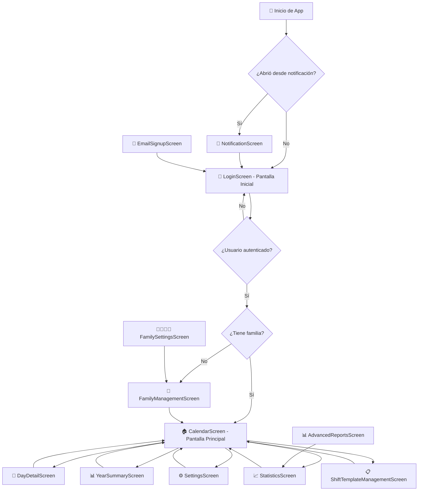
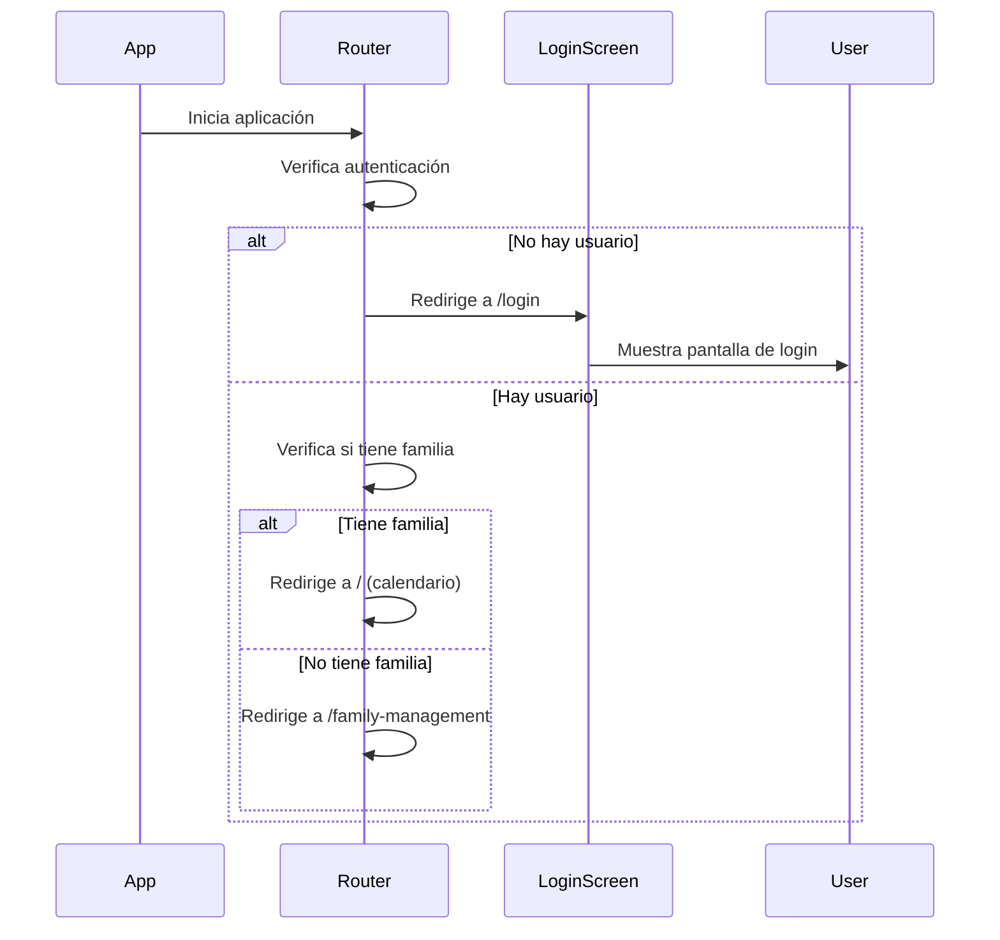
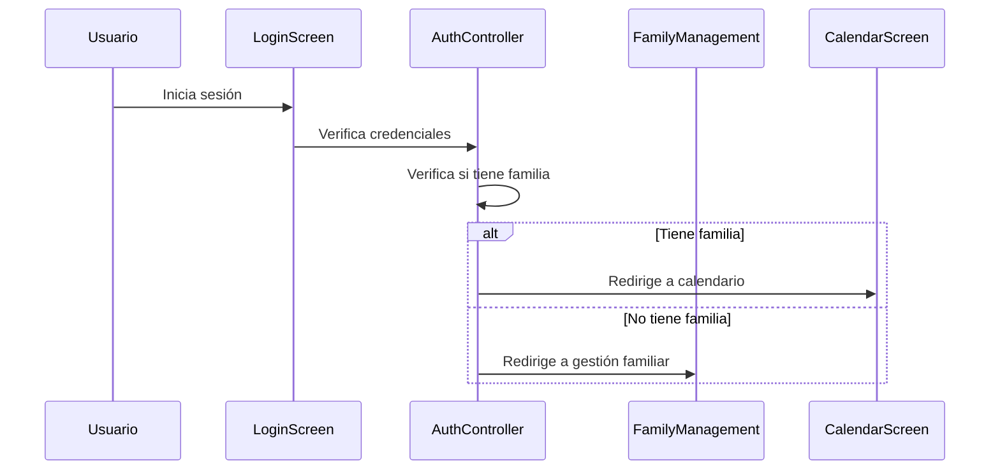
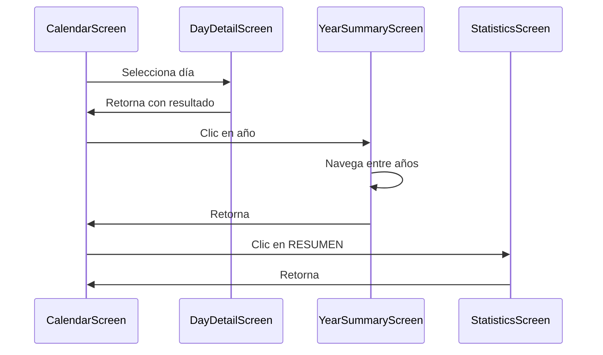
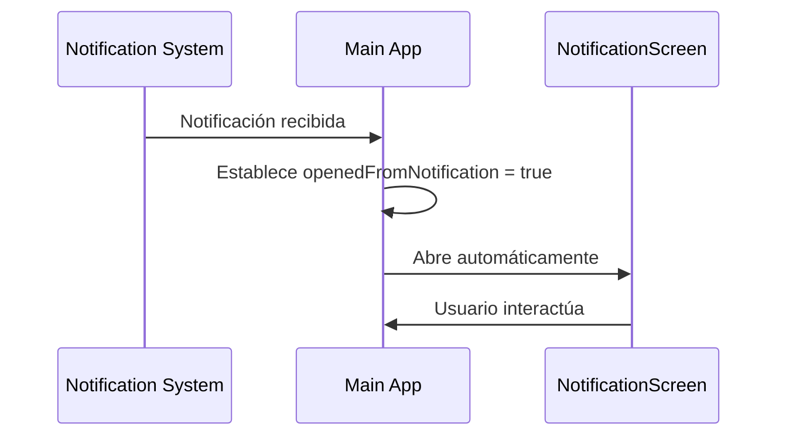

# 🗺️ Diagrama de Navegación de Pantallas - Calendario Familiar

## 📱 **Vista General del Sistema de Navegación**

La aplicación utiliza **Go Router** para manejar la navegación entre pantallas, con un sistema de rutas jerárquico y navegación inteligente basada en el estado del usuario. **Ahora la aplicación inicia en la pantalla de login si no hay usuario autenticado**.

---

## 🔄 **Flujo Principal de Navegación**



---

## 🛣️ **Rutas de Navegación Detalladas**

### **🔐 Pantalla de Login (`/login`) - NUEVA PANTALLA INICIAL**
- **Archivo**: `LoginScreen`
- **Funcionalidad**: **Pantalla inicial de la aplicación** - Autenticación de usuarios
- **Navegación desde aquí**:
  - **Con familia** → `/` (calendario principal)
  - **Sin familia** → `/family-management`
  - **Registro** → `/email-signup`

### **📝 Registro por Email (`/email-signup`)**
- **Archivo**: `EmailSignupScreen`
- **Funcionalidad**: Registro de nuevos usuarios
- **Navegación**: Retorna a login con la misma lógica de verificación

### **📱 Notificaciones (`/notification-screen`)**
- **Archivo**: `NotificationScreen`
- **Funcionalidad**: Mostrar alarmas y recordatorios (pública)
- **Navegación**: Retorna a la pantalla anterior

### **🏠 Pantalla Principal (`/`) - Requiere Autenticación**
- **Archivo**: `CalendarScreen`
- **Funcionalidad**: Vista principal del calendario mensual
- **Navegación desde aquí**:
  - 📅 **Día específico** → `/day-detail` (con datos del día)
  - 📊 **Año** → `/year-summary` (con año seleccionado)
  - 📈 **RESUMEN** → `/statistics`
  - ⚙️ **Configuración** → `/settings`
  - 👥 **Gestión familiar** → `/family-management`
  - 📋 **Plantillas de turnos** → `/shift-templates`

### **📅 Detalle del Día (`/day-detail`) - Requiere Autenticación**
- **Archivo**: `DayDetailScreen`
- **Funcionalidad**: Crear/editar eventos para un día específico
- **Datos pasados**: `date`, `existingText`, `existingEventId`
- **Navegación**: Retorna a la pantalla anterior con `context.pop()`

### **📊 Resumen Anual (`/year-summary`) - Requiere Autenticación**
- **Archivo**: `YearSummaryScreen`
- **Funcionalidad**: Vista de todos los meses del año
- **Navegación**:
  - **Año anterior** → `/year-summary` (año - 1)
  - **Año siguiente** → `/year-summary` (año + 1)
  - **Retorno** → `context.pop()`

### **📈 Estadísticas (`/statistics`) - Requiere Autenticación**
- **Archivo**: `StatisticsScreen`
- **Funcionalidad**: Reportes y estadísticas del calendario
- **Navegación**:
  - **Mes actual** → `/` (calendario principal)
  - **Año** → `/year-summary`
  - **Reportes avanzados** → `/advanced-reports`

### **⚙️ Configuración (`/settings`) - Requiere Autenticación**
- **Archivo**: `SettingsScreen`
- **Funcionalidad**: Configuración general de la aplicación
- **Navegación**: Retorna a la pantalla anterior

### **👥 Gestión Familiar (`/family-management`) - Requiere Autenticación**
- **Archivo**: `FamilyManagementScreen`
- **Funcionalidad**: Crear familia o unirse a una existente
- **Navegación**:
  - **Continuar a la App** → `/` (calendario principal)
  - **Configuración de familia** → `/family-settings`

### **📋 Plantillas de Turnos (`/shift-templates`) - Requiere Autenticación**
- **Archivo**: `ShiftTemplateManagementScreen`
- **Funcionalidad**: Gestionar plantillas de turnos familiares
- **Navegación**: Retorna a la pantalla anterior

---

## 🔀 **Tipos de Navegación Utilizados**

### **1. Navegación Push (`context.push`)**
```dart
// Navegar a una nueva pantalla (mantiene la anterior en el stack)
context.push('/day-detail', extra: {
  'date': selectedDate,
  'existingText': existingText,
  'existingEventId': existingEventId,
});
```

### **2. Navegación Go (`context.go`)**
```dart
// Navegar y reemplazar la pantalla actual (útil para login/logout)
context.go('/'); // Ir al calendario principal
context.go('/family-management'); // Ir a gestión familiar
```

### **3. Navegación Pop (`context.pop`)**
```dart
// Retornar a la pantalla anterior
context.pop();
```

---

## 🎯 **Flujos de Navegación Específicos**

### **🔄 Flujo de Inicio de Aplicación**


### **🔐 Flujo de Autenticación**


### **📅 Flujo de Navegación del Calendario**


### **🔔 Flujo de Notificaciones**


---

## 🎨 **Elementos de Navegación en la UI**

### **Header Superior del Calendario**
- **"Calendario"** → Texto estático
- **Año** → Clickable → `/year-summary`
- **"RESUMEN"** → Clickable → `/statistics`

### **AppBar del Calendario**
- **⚙️ Configuración** → `/settings`
- **📅 Plantillas** → `/shift-templates`
- **👥 Familia** → `/family-management`

### **Celdas del Calendario**
- **Click en día** → `/day-detail` (con datos del día)

---

## 🔧 **Configuración Técnica**

### **Router Principal con Riverpod**
```dart
final appRouterProvider = Provider<GoRouter>((ref) {
  return GoRouter(
    navigatorKey: navigatorKey,
    initialLocation: openedFromNotification ? '/notification-screen' : '/login',
    redirect: (context, state) {
      // Lógica de redirección automática con verificación de autenticación
      final currentUser = ref.read(authControllerProvider);
      
      if (currentUser == null && 
          !state.fullPath.startsWith('/login') && 
          !state.fullPath.startsWith('/email-signup') &&
          state.fullPath != '/notification-screen') {
        return '/login';
      }
      
      return null;
    },
    routes: [
      // Definición de todas las rutas
    ],
  );
});
```

### **Manejo de Errores**
```dart
errorBuilder: (context, state) => Scaffold(
  // Pantalla de error 404 con botón para volver al inicio
  ElevatedButton(
    onPressed: () => context.go('/'),
    child: const Text('Volver al inicio'),
  ),
),
```

---

## 📱 **Estados de Navegación**

### **Estado Inicial**
- **Sin notificación**: `/login` (LoginScreen) - **NUEVO COMPORTAMIENTO**
- **Con notificación**: `/notification-screen`

### **Estado Post-Autenticación**
- **Usuario con familia**: `/` (CalendarScreen)
- **Usuario sin familia**: `/family-management`

### **Estado de Error**
- **Ruta no encontrada**: Pantalla de error con botón de retorno

---

## 🚀 **Mejoras de Navegación Implementadas**

### **✅ Características Actuales**
- **Nueva pantalla inicial**: Login como punto de entrada
- **Verificación automática de autenticación**: Redirección a login si no hay usuario
- **Navegación automática desde notificaciones**
- **Redirección inteligente post-autenticación**
- **Manejo de parámetros entre pantallas**
- **Sistema de navegación jerárquico**
- **Manejo de errores de navegación**

### **🔮 Futuras Mejoras Sugeridas**
- Animaciones de transición entre pantallas
- Deep linking para compartir enlaces específicos
- Navegación con gestos (swipe)
- Historial de navegación
- Navegación por voz

---

## 📋 **Resumen de Rutas**

| Ruta | Pantalla | Función | Autenticación | Navegación |
|------|----------|---------|---------------|------------|
| `/login` | LoginScreen | **Pantalla inicial** | ❌ Pública | Central |
| `/email-signup` | EmailSignupScreen | Registro | ❌ Pública | Push |
| `/notification-screen` | NotificationScreen | Notificaciones | ❌ Pública | Auto |
| `/` | CalendarScreen | Pantalla principal | ✅ Requerida | Central |
| `/day-detail` | DayDetailScreen | Detalle del día | ✅ Requerida | Push |
| `/year-summary` | YearSummaryScreen | Resumen anual | ✅ Requerida | Push |
| `/statistics` | StatisticsScreen | Estadísticas | ✅ Requerida | Push |
| `/settings` | SettingsScreen | Configuración | ✅ Requerida | Push |
| `/family-management` | FamilyManagementScreen | Gestión familiar | ✅ Requerida | Go |
| `/shift-templates` | ShiftTemplateManagementScreen | Plantillas | ✅ Requerida | Push |

---

## 🔐 **Sistema de Autenticación**

### **Flujo de Verificación**
1. **App inicia** → Verifica si hay usuario autenticado
2. **Sin usuario** → Redirige a `/login`
3. **Con usuario** → Verifica si tiene familia
4. **Con familia** → Redirige a `/` (calendario)
5. **Sin familia** → Redirige a `/family-management`

### **Rutas Públicas vs Protegidas**
- **Públicas**: `/login`, `/email-signup`, `/notification-screen`
- **Protegidas**: Todas las demás rutas requieren autenticación

---

*Este diagrama representa la arquitectura de navegación completa de la aplicación Calendario Familiar, mostrando que ahora inicia en login si no hay usuario autenticado, con todas las rutas, flujos y patrones de navegación implementados.*
